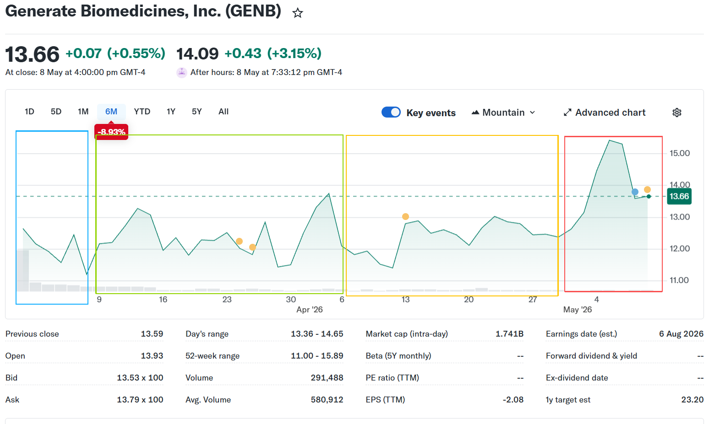

第一部分：融资历程的深度解构与资本战略生态系统的构建

1.1 A轮融资：概念验证与生成生物学技术基石的奠定（2020年9月）

现代生物科技的颠覆性创新往往孕育于极具远见且拥有深厚资源禀赋的顶级孵化器之中。GENB的诞生正是源于全球最负盛名的生命科学风险投资机构 Flagship Pioneering 内部长达两年的隐秘基础研究。（注：这意味着GENB并不是传统的VC，而是venture studio，具体见GENB-钱的部分.pdf）

Flagship Pioneering 的投资哲学在于“开创不可能”，其并不追逐既有的技术风口，而是致力于在生物学与计算科学的交叉盲区中孵化具有底层范式转移潜力的平台型企业（如其曾成功孵化的mRNA巨头Moderna）。（注：该企业在2010年通过Venture Studio模式被发掘，其高层领导中Flagship Pioneering背景占比高，被认为是VS模式成功的典范，这也进一步导致后续GENB融资期间诸多融资机构对它具有明显的信心）

根据公开融资数据记录，2020年9月，GENB正式宣布完成5,000万美元的A轮融资。本轮融资的核心特征在于其高度的“内部化”，<u>资金由创始机构 Flagship Pioneering 独家或主导提供，而此时公司的投后估值处于严格保密（未披露）状态</u>。这一时期的宏观背景正值全球新冠疫情肆虐的初期，基于mRNA序列设计的疫苗以前所未有的速度被开发出来，这在客观上极大地启蒙了资本市场对于“可编程生物学”（Programmable Biology）的认知，为GENB后续的融资创造了绝佳的宏观情绪铺垫。

**A轮总结：这一轮共获得VS母公司Flagship Pioneering的5000万美元融资。这些钱不多，基本被用于技术验证与平台搭建。这一阶段，GENB被要求证明其技术可行性，并且建立实验与计算平台，同时还具有前瞻性地搭建了“干湿实验闭环”的实验体系**。

1.2 B轮融资：资本狂热、估值跃升与物理产能的爆炸式扩张（2021年11月）

如果说A轮融资是黑暗中的摸索，那么B轮融资则标志着GENB正式走向全球顶级资本舞台的中央。2021年11月18日，GENB震撼性地宣布完成了高达3.70亿美元的B轮外部股权融资。根据相关投资记录，此轮融资将公司的预估投后估值一举推高至约15.2亿美元，使其迅速跻身生物科技领域的“独角兽”行列。

**融资背景与宏观环境**： 2021年末是全球一级资本市场流动性最为充裕的时期。在零利率政策（ZIRP）和量化宽松的刺激下，风险资本对具有颠覆性潜力、长久期回报的深科技（Deep Tech）资产表现出极度的狂热。同时，2021年7月，AI在蛋白质结构预测（如AlphaFold 2的突破）领域的进展引发了整个科学界的轰动，市场对AI驱动药物发现（AIDD）的估值容忍度达到了历史顶峰。GENB正是完美契合了“顶级机构背书+颠覆性AI故事+无限扩展的平台潜力”这一终极叙事，从而以极高的溢价完成了本轮天量融资。

B轮投资方的阵容呈现出极其显著的“主权财富基金+顶级交叉基金（Crossover Funds）+硬核科技VC”的复合结构 。

- 主权财富基金与长线资本：包括阿布扎比投资局（ADIA）的全资子公司和阿拉斯加永久基金（Alaska Permanent Fund）。这类机构的特质是资金体量极其庞大且对投资回报的久期容忍度极高，他们看重的是GENB在未来十年重塑整个制药产业链的系统性贝塔（Beta）收益。

- 顶级交叉基金：如富达管理与研究公司（Fidelity Management & Research Company）和 T. Rowe Price等。交叉基金的密集入局通常是初创企业准备向公开二级市场（IPO）冲刺的明确先兆。他们不仅提供充裕的资金，更为公司后续的上市定价提供锚点与流动性保障。

- 硬核科技风险投资：ARCH Venture Partners 作为全球最具影响力的早期生物科技风投之一，其投资风格以敢于押注极其前沿、高风险的基础科学创新而著称。ARCH的参与，在业内被视为对GENB底层科学逻辑（Science Validation）的最强硬背书。

**B轮总结：从融资结构上看，B轮获得的融资整体是多元且健壮的，既有愿意长期持股的主权基金，也有科技风投的介入，这意味着当时的一级市场在各方面都比较看好GENB。此次融资约3.7亿美金，这一巨大的资金成功帮助GENB完成扩张，将员工数量从早期的80余人扩张至500余人，并且在马萨诸塞州规划了大型蛋白质实验室。这一实验室同时也是其“干湿实验闭环”的体现，此时GENB不仅完善了其特色的生物计算平台（干实验），通过借助蛋白质实验室复现理论计算得到的实验产物（湿实验），这一实验循环模式是同时期其他同类科技初创公司不具备的。**

1.3 C轮与扩展轮融资：穿越周期、产业协同与生态链闭环的构建（2023年9月至2024年初）

生物科技产业的资本周期往往伴随着极端的繁荣与萧条。进入2023年，随着全球央行进入激进的加息周期，宏观流动性骤然收紧，生物科技行业步入了极为严酷的“资本寒冬”。大量依赖外部输血的平台型初创企业面临估值倒挂甚至资金链断裂的生死存亡危机 。然而，正是在这样肃杀的宏观背景下，GENB展现出了极其罕见的吸金能力。2023年9月14日，公司宣布逆势完成2.73亿美元的C轮融资，不仅保持了约19.0亿至22.2亿美元的超高估值水平，更在随后于2024年初引入了战略扩展轮融资，维持了其高位估值体系。

C轮及后续扩展轮融资在投资者结构上发生了本质的战略转向，其核心特征是从纯财务投资者向拥有深厚产业资源的战略资本（Corporate Venture Capital, CVC）倾斜。除了B轮的蓝筹老股东（如ADIA、Fidelity、T. Rowe Price、ARCH）<u>全额跟投以表明坚定的信心</u>外，一系列具有标志性意义的产业巨头加入了GENB的股东阵营 。

- NVentures (NVIDIA/英伟达的风险投资部门)：英伟达的战略投资对GENB而言具有跨时代的里程碑意义。生成生物学的本质是算力密集的机器学习任务，极其依赖于底层的GPU基础设施与算法优化。英伟达不仅提供资金，更通过其 BioNeMo平台等软硬件生态，在底层算力架构、物理AI与机器人实验室自动化等方面与GENB形成了深度的技术协同。这种计算硬件霸主与生物算法龙头的绑定，构筑了几乎不可逾越的技术壁垒。

- Amgen（安进）与顶级药企资本：作为全球老牌生物制药巨头，Amgen的入局代表了传统“大药厂”（Big Pharma）对生成生物学在临床端转化潜力的彻底折服。Amgen不仅是财务投资，更在此前后与GENB达成了涉及多个靶点、潜在总价值高达19亿美元的深度研发合作协议，进一步验证了GENB平台的商业化变现能力 。

- Samsung BioLogics（三星生物）等上下游产业资本：在2024年初的C轮扩展融资中，通过三星生命科学基金（Samsung Life Science Fund），全球顶级的大分子定制研发生产企业（CDMO）三星生物完成了对GENB的战略投资。这一步棋堪称神来之笔。由AI从头生成的全新蛋白质分子往往具有异于自然界已知蛋白的物理化学特性，其大规模制造与纯化工艺极具挑战性。三星的入局，不仅为GENB未来的管线商业化提供了稳定、高品质的顶级代工产能保障，更在产业链上下游形成了强大的生态协同效应，锁定了从算法设计到最终成药的制造闭环 。

**C轮融资总结：个人认为C轮融资是真正奠定GENB发展基础的一轮融资。之前的A轮来源于VS培养体系，属于实验性质；B轮基本来源于风投和基金，只能说明市场对于“可编程生物技术”能赚到钱有信心，而这很难不是受到alphafold2以及普遍乐观思潮的影响。C轮有B轮老股东跟投，说明一级市场保持信心；又有上述三个技术、产业领域大拿入股，则说明对于GENB这个公司而言，技术界和产业界认可其技术与产业能力，并且愿意在技术与产业领域深度合作，形成壁垒。因此，C轮最核心的融资不在于2.73亿美金，尽管这笔钱确实让GENB有钱支持每年推进10个项目，真正核心的融资是NVIDIA的算力、Amgen的临床开发经验、Samsung的制造产能。**

1.4 IPO首次公开募股：登陆二级市场与管线冲刺的资本决战（2026年2月）

经过多轮一级市场资金的洗礼与底层技术的不断迭代，GENB最终在2026年迎来了叩开公开资本市场大门的历史时刻。2026年2月26日，Generate Biomedicines, Inc. 正式宣布了其首次公开募股（IPO）的定价细节。公司以每股 16.00 美元的发行价格，向公众发售了 25,000,000 股普通股，成功从华尔街募集了约 4.00 亿美元的总资金（在扣除承销折扣、佣金及其他发行费用前） 。同时，公司还向承销商授予了在30天内按初始发行价额外购买高达 3,750,000 股的选择权 。2026年2月27日，GENB的股票正式在纳斯达克全球精选市场（Nasdaq Global Select Market）挂牌交易，证券代码为“GENB” 。

但是，这实际上可能是一个无奈的必然选择。从公司自身的财务健康状况来看，作为一家处于临床阶段且完全没有获批商业化产品收入的生物科技企业，GENB的资金消耗速度极其惊人。据公开披露的财务数据显示，公司在2025财年录得了高达2.23亿美元的净亏损。高强度的研发投入（如维持庞大的超级计算中心运转、进行昂贵的 CryoEM 结构解析、以及支付开展全球多中心3期临床试验的天价费用）使得公司此前的现金储备正在被快速吞噬。管理层甚至在早期的财务评估中，对公司在2025年底之后的“持续经营能力”（Going Concern）提出过实质性的疑虑。因此，通过公开市场进行大规模、低成本的股权融资，是维持公司基本面生存、避免在此关键阶段因资金链断裂而功亏一篑的必然选择。

当然，这种问题必须写在IPO招股书中，自然引发了市场的悲观情绪。同时，GENB的上市正值美国政府连续出问题的时间段，美联储连续加息，政府部门间断性停摆，波斯湾冲突加剧，这导致大部分基金对新兴产业保持观望态度。此外，在GENB之前，AI制药赛道上已经有不少初创科技公司折戟，市场也普遍不看好AI制药。上述因素叠加之下，GENB上市首日即跳水。

虽然有回升，但是这主要出于“买跌”情绪，整体上不及GENB上市预期。

从3月初开始，GENB从华尔街募集的约3.6亿美元资金到账，这冲淡了投资者的悲观情绪，股价逐渐开始回暖。3月中旬，华尔街的卖方评估机构（如高盛、摩根士丹利、古根海姆）逐渐开始发布对GENB的评估，不断给出“买入”的积极信号，这引发了一部分买入现象，股价出现间断性回暖。  
4月初开始，由于之前的机构评估拉高了股价，但是市场本身还是缺乏信心，GENB相关药物实验没有完成，也没有公布数据，因此大量投资选择在股价高点卖出，这导致了股价再次降低。4月13日，投行H.C. Wainwright给出“买入”评级，理由是GENB核心药物管线GB-0895在临床试验三期进展顺利，这重新拉升了股价。

从4月末到5月初，GENB在4月30日敲响了纳斯达克的开市钟，提高了曝光度，同时近日Anthropic以及OpenAI等头部AI企业酝酿发布新模型，炒热了AI相关概念，这导致GENB的股价一路上涨，抵达约15美元高点，而相关概念炒作结束后，可以看到股价也迅速降低。不过由于Anthropic与OpenAI仍在发布新的模型预告，以及Google在5月份的开发者大会即将举行，AI产业的余波仍在，所以GENB的股价在该信息影响下仍处于高位。
