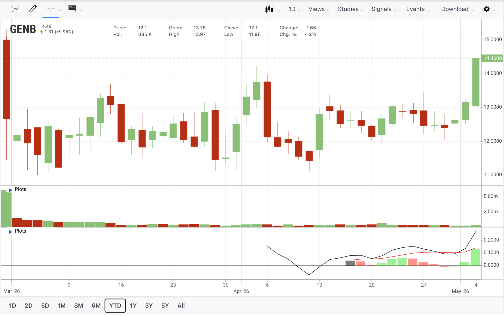
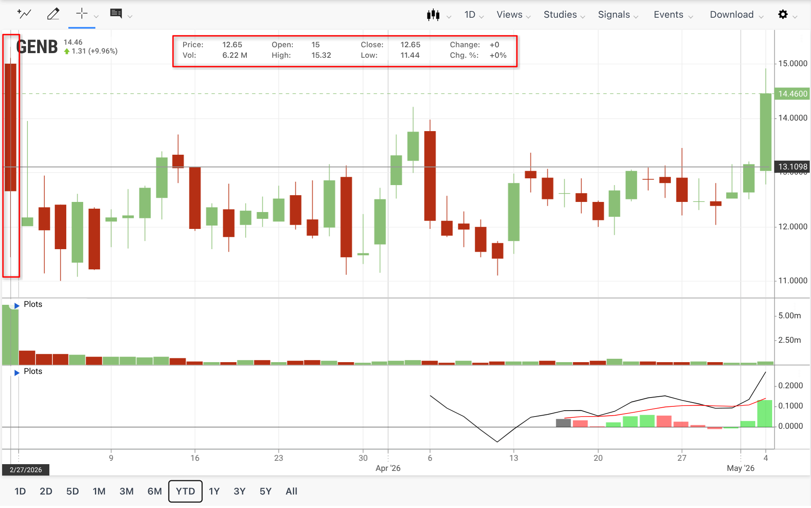
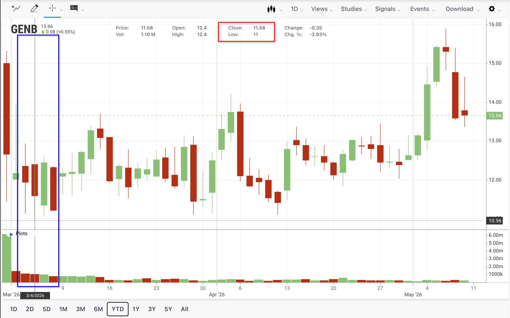
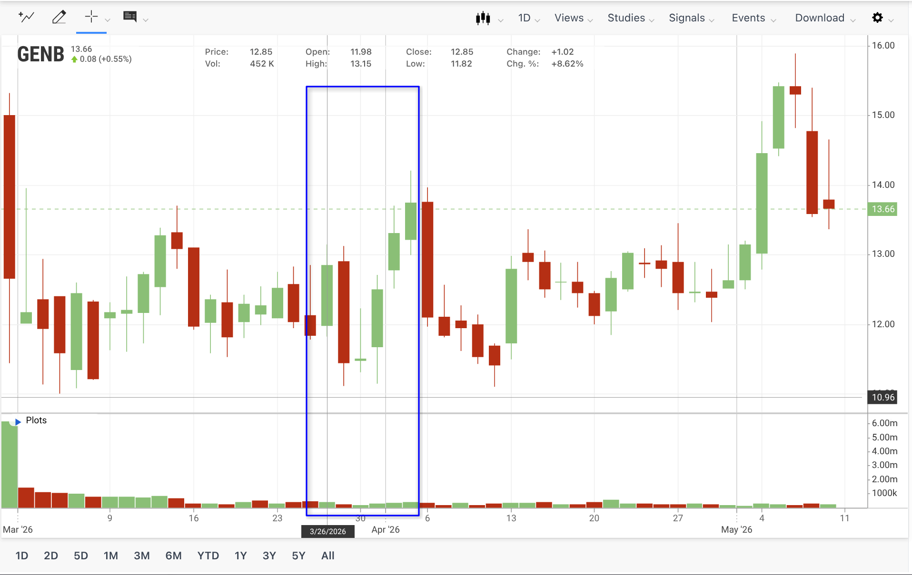
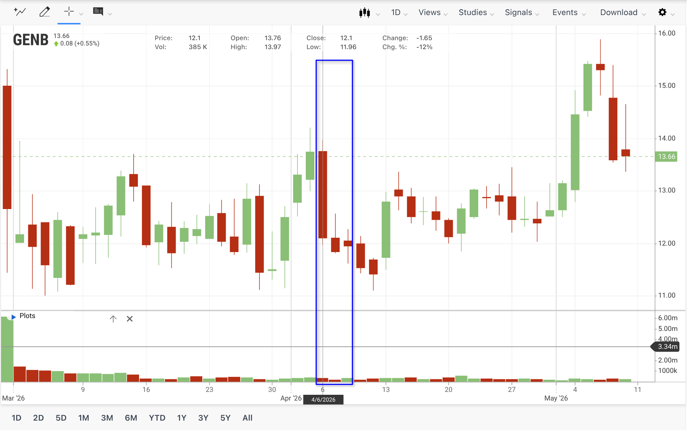
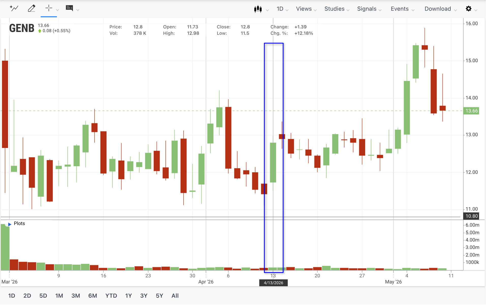
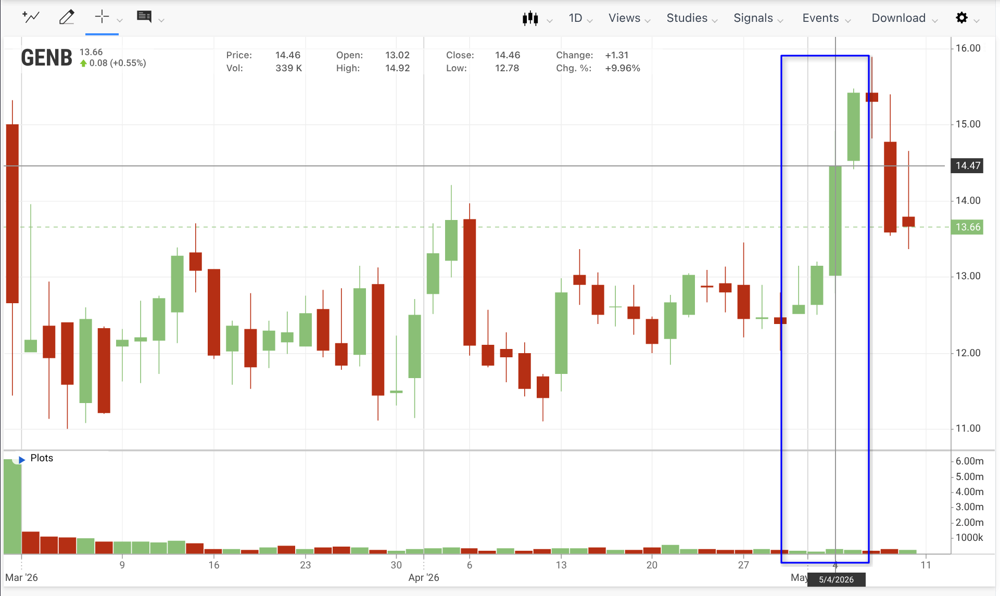
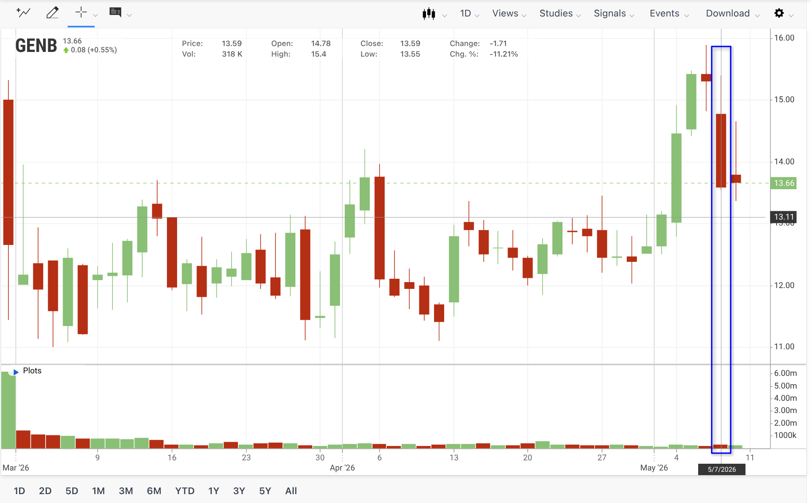

According to a document from 2026-02-26（Generate Biomedicines 424B4 招股书）和截至 2026-05-05 的公开行情，下面是“钱”这一部分可以直接用于 pre 的资料整理稿。老师演示课件里对“钱”的要求本质上是四件事：股价/市值变化、每轮融资、主要股东、现金状况；我按这个逻辑整理，并额外加入了 Amgen / Novartis 这种平台型 biotech 很关键的 BD 资金。

## 0. 一句话结论

Generate Biomedicines 已经证明自己“能拿到钱”：IPO 前通过优先股、可转债、合作付款等已取得超过 9.34 亿美元资金；IPO 又以 16 美元/股发行 2,500 万股，募资 4 亿美元。但市场给出的反馈并不完全乐观：上市首日跌破发行价，当前股价仍低于 IPO 价，核心原因是投资人认可 Flagship、Amgen、Novartis 背书和 GB-0895 的 Phase 3 进展，但仍在等待 AI 蛋白设计平台的临床兑现。 ([Reuters](https://www.reuters.com/business/healthcare-pharmaceuticals/flagship-backed-generate-biomedicines-shares-fall-6-nasdaq-debut-2026-02-27/))

------

## 1. 融资历史：Generate 的钱不是只来自 IPO

### 1.1 融资总览

截至 2025 年底，Generate 披露其已通过优先股私募、可转债、Amgen / Novartis 合作付款、成本分摊等方式取得超过 9.34 亿美元总现金来源，其中优先股出售 8.053 亿美元、已偿还 term loan 1,200 万美元、已转换可转债 750 万美元、Amgen 和 Novartis 合作付款 1.10 亿美元。IPO 后再增加 4 亿美元 gross proceeds，即“历史已到账资金 + IPO gross proceeds”超过 13.34 亿美元。

| 时间          | 阶段                    | 关键融资/资源事件                                            | 说明                                                         |
| ------------- | ----------------------- | ------------------------------------------------------------ | ------------------------------------------------------------ |
| **2018–2020** | **Flagship 内部孵化期** | 由 Flagship Pioneering 孵化成立，并获得 Flagship 的平台资源支持；公司与 Flagship 签订管理服务协议，由 Flagship 提供会计、人力、IT、法律、咨询等后台与运营支持，公司按约定报销相关费用。 | 这一阶段不是典型外部融资轮次，更像 Flagship 的 venture creation 模式：通过内部资金、组织资源和专业服务支持公司完成早期技术验证与平台搭建，为后续公开亮相和外部融资做准备。 |

>**2018–2020：Flagship 内部孵化期** —— Generate 由 Flagship Pioneering 孵化成立，早期依托 Flagship 的 venture creation 平台完成技术与公司搭建；同时，公司与 Flagship 签订管理服务协议，获得会计、人力、IT、法律、咨询等后台资源支持，因此这一阶段更应理解为“内部孵化与资源投入”，而非公开外部融资轮次。

| 时间              | 资金事件                               | 金额 / 股数                                                  | 主要投资人或来源                                             | 对公司的意义                                                 |
| ----------------- | -------------------------------------- | ------------------------------------------------------------ | ------------------------------------------------------------ | ------------------------------------------------------------ |
| 2020 前后         | Series A 优先股                        | 40,100,000 股 Series A；账面价值约 4,005 万美元；可转换为约 26.40M 股普通股 | 早期主要由 Flagship 体系支持；公司 2021 年 Series B 新闻称 Series B 是“first external equity raise” | 早期平台搭建资金，折合普通股成本约 1.52 美元/股，远低于后续轮次。 ([Generate:Biomedicines](https://generatebiomedicines.com/media-center/generate-biomedicines-announces-first-external-equity-raise-of-370-million-to-advance-its-drug-generation-platform)) |
| 2021.11           | Series B / first external equity raise | 官方新闻稿：3.70 亿美元；招股书中 Series B outstanding 31,512,642 股，账面价值约 3.731 亿美元，可转换为约 20.75M 股普通股 | Flagship Pioneering、ADIA 子公司、Alaska Permanent Fund、Altitude Life Science Ventures、ARCH、Fidelity、Morningside、T. Rowe Price 等 | 第一轮大规模外部融资，用于扩展平台、团队、多个项目进入 IND；折合普通股成本约 18 美元/股。([Generate:Biomedicines](https://generatebiomedicines.com/media-center/generate-biomedicines-announces-first-external-equity-raise-of-370-million-to-advance-its-drug-generation-platform)) |
| 2022.01           | Amgen 多靶点合作                       | 5,000 万美元 upfront；初始 5 个项目，潜在交易价值 19 亿美元 + royalties | Amgen                                                        | 这是平台变现能力的第一类证明：大药企为 Generate 平台能力付费，而不是只买某个单一药物。([Amgen](https://www.amgen.com/newsroom/press-releases/2022/01/amgen-and-generate-biomedicines-announce-multitarget-multimodality-research-collaboration-agreement)) |
| 2023.05           | Amgen 战略股权投资                     | Amgen 购买 2,109,704 股 Series C，约 2,500 万美元            | Amgen                                                        | 合作方不只付 upfront，还愿意买股，说明其对平台和公司长期价值有一定认可。 |
| 2023.09           | Series C 首次宣布                      | 官方新闻稿：2.73 亿美元；新增投资人包括 Amgen、NVentures、MAPS Capital、Pictet Alternative Advisors；Flagship 和 Series B 投资人继续参与 | Amgen、NVentures、MAPS、Pictet、Flagship、ADIA、Fidelity、T. Rowe Price、ARCH、March Capital 等 | 资金用于推进 17 个已有项目、每年约 10 个新项目、多个 IND 和临床试验；说明 AI biotech 在私募市场仍可获得大额资金。([Generate:Biomedicines](https://generatebiomedicines.com/media-center/series-c-financing-announcement)) |
| 2023.12 / 2024    | Amgen 合作修订与里程碑                 | 第二次修订增加一个合作靶点，Generate 获得额外 500 万美元；2024 年一个开发里程碑触发 500 万美元 milestone | Amgen                                                        | 平台合作开始产生后续 milestone，虽然金额不大，但比单纯融资更能证明平台商业化能力。 |
| 2024.09           | Novartis 多靶点合作                    | 6,500 万美元 upfront cash，其中 5,000 万美元为 upfront，1,500 万美元为股权购买；潜在 milestone 超过 10 亿美元 + royalties | Novartis                                                     | 第二家大药企合作，进一步证明 Generate 可通过平台合作获得非稀释 / 半稀释资金。([Generate:Biomedicines](https://generatebiomedicines.com/media-center/generatebiomedicines-announces-multi-target-collaboration-with-novartis)) |
| 2023.05–2025.01   | Series C 全部完成                      | 招股书披露：累计发行 33,704,613 股 Series C，11.85 美元/股，总购买价约 3.994 亿美元；2025.01 还追加发行 1,856,539 股，获得约 2,200 万美元 | 多轮 Series C 投资人、战略投资人                             | Series C 是 IPO 前最大的一轮股权融资；但折合普通股成本约 18 美元/股，高于 IPO 价 16 美元。 |
| 2026.02 / 2026.03 | IPO                                    | 25,000,000 股，16 美元/股，gross proceeds 4 亿美元；扣除承销折扣和费用后的预计 net proceeds 约 3.688 亿美元。最新的Q1财报披露实际净融资 **$369.3M**，比预估略高。 | 公开市场投资者；Goldman Sachs、Morgan Stanley 等承销         | IPO 的直接目的不是盈利退出，而是给 Phase 3、COPD、平台和肿瘤项目补现金。 ([PR Newswire](https://www.prnewswire.com/news-releases/generate-biomedicines-inc-announces-pricing-of-initial-public-offering-302699146.html)) |

> 注：Generate 在 IPO 前进行了 1-for-1.5190 reverse stock split（反向拆股），约等于每 1.519 股旧股合并为 1 股新股。因此本页涉及的“每股成本”和“IPO 后股数”均按招股书的合股后口径计算，方便与 16 美元 IPO 发行价直接比较。

### 1.2 核心分析：融资质量很高，但估值压力明显

Series B / C 的折合普通股成本大约是 18 美元/股，而 IPO 发行价是 16 美元/股，说明 IPO 不是“高估值顺风上市”，更像是为了获得临床后期资金而接受了比后期私募轮更低的公开市场定价。这个点很适合在 pre 里讲：**公司能融资，但公开市场比私募市场更谨慎。**

------

## 2. 非稀释 / 半稀释资金：Amgen 和 Novartis 是“平台变现能力”的证据

Generate 的商业模式不是只靠自己把药做完上市。它是平台型 biotech，所以商业合作收入、upfront、milestone、royalty 都是融资方式。招股书明确说，公司至今没有产品销售收入，主要通过优先股、可转债、Amgen / Novartis 付款和合作成本分摊来融资。

| 合作方        | 已到账资金                                                   | 潜在未来资金                                                 | 重点分析                                                     |
| ------------- | ------------------------------------------------------------ | ------------------------------------------------------------ | ------------------------------------------------------------ |
| Amgen         | 5,000 万美元 upfront；2023 年 Amgen 约 2,500 万美元股权投资；2023 年修订额外 500 万美元；2024 年开发 milestone 500 万美元 | 每个项目最高 3.70 亿美元 milestone，其中 1.60 亿美元开发/监管 milestone、2.10 亿美元商业 milestone；还有 mid-single digit 到 low tens 的销售 royalty | Amgen 合作最能体现“平台外包式研发”的价值：Amgen 让 Generate 为多个靶点设计蛋白/抗体。2024 和 2025 年 Generate 分别确认 Amgen 相关收入 1,820 万美元和 670 万美元，剩余 310 万美元预计 2026 年确认。 |
| Novartis      | 5,000 万美元 upfront + 1,500 万美元 Series C 股权购买        | 全项目最高约 10 亿美元 milestone；每个 research program 包含 1.30 亿美元开发/监管 milestone 和 2.10 亿美元商业 milestone；royalty 为 mid-single digit 到 low tens | Novartis 合作说明 Generate 的平台不是只被一家药企验证。招股书也说明截至招股书时 Novartis milestones 尚未达成，因此这 10 亿美元不能当作确定资金，只能当作 contingent upside。 |
| PMCo / PM LLC | 2023、2024、2025 年分别向 PMCo 分摊/分配研发费用 320 万、700 万、1,930 万美元 | IPO 相关交易后 Generate 收购 PMCo，并未来需向 PM LLC 支付某些 Generate Products 净销售额的 high-single digit 百分比 | 这是“成本分摊换未来收入权”的结构。短期降低 Generate 自己承担的研发现金压力，但如果 GB-0895 等产品未来上市，需要让渡一部分净销售额。 |

**讲述建议：** Generate 的“钱”不是单一融资故事，而是三条线：VC / 战略股权、BD upfront + milestone、IPO。Amgen 和 Novartis 的意义不只是钱，更是第三方药企对平台的认证；但 milestone 高并不等于现金已经到账，真正确定的合作付款截至 2025 年底是 1.10 亿美元，不应把潜在 milestone 当成现有现金。

------

## 3. IPO 和股价波动：能上市，但市场仍然谨慎

## Stock market information for Generate Biomedicines Inc (GENB)

- Generate Biomedicines Inc is a equity in the USA market.
- The price is 14.46 USD currently with a change of 1.31 USD (0.10%) from the previous close.
- The latest trade time is Monday, May 4, 14:15:00 HST.

### 3.1 IPO 基本情况

Generate 以 16 美元/股发行 2,500 万股，gross proceeds 为 4 亿美元；公司还给了承销商 30 天选择权，可额外购买 375 万股。招股书披露，发行后普通股为 127,450,201 股；按 16 美元 IPO 价计算，上市时隐含市值约 20.4 亿美元。

IPO 的用途非常具体：约 3 亿美元推进 GB-0895 两个 severe asthma Phase 3 试验；约 1 亿美元用于 COPD Phase 1b 及下一阶段；约 7,500 万美元用于平台和多个项目推进到 development candidate / IND-enabling；约 1,500 万美元用于 GB-4362 和 GB-5267 Phase 1 topline data。

### 3.2 上市以来股价表现

Generate Biomedicines 于 2026 年 2 月 26 日定价 IPO，发行 2,500 万股、发行价 16 美元，募资总额约 4 亿美元，并于 2 月 27 日以股票代码 GENB 在 Nasdaq 开始交易。([Generate:Biomedicines](https://generatebiomedicines.com/media-center/generate-biomedicines-inc-announces-pricing-of-initial-public-offering)) 截至 5 月 6 日，股价约 15.30 美元、市值约 19.5 亿美元；按 IPO 参考市值约 20.4 亿美元计算，上市以来仍略低于 IPO 定价水平，但已从首日收盘低位明显修复。([MarketBeat](https://www.marketbeat.com/stocks/NASDAQ/GENB/))

#### 上市首日破发

| 节点                 | 股价 / 市值                                    | 变化               | 解读                                                         |
| -------------------- | ---------------------------------------------- | ------------------ | ------------------------------------------------------------ |
| IPO 定价，2026-02-26 | 16.00 美元/股；隐含市值约 20.4 亿美元          | 基准               | 成功完成 4 亿美元大额 IPO，说明 2026 年 biotech IPO 窗口有所恢复。 ([PR Newswire](https://www.prnewswire.com/news-releases/generate-biomedicines-inc-announces-pricing-of-initial-public-offering-302699146.html)) |
| 首日开盘，2026-02-27 | 15.00 美元/股；Reuters 报道较 IPO 价低 6% 以上 | -6.25%             | **开盘即破发**，说明发行成功不等于二级市场认可估值。([Reuters](https://www.reuters.com/business/healthcare-pharmaceuticals/flagship-backed-generate-biomedicines-shares-fall-6-nasdaq-debut-2026-02-27/)) |
| 首日收盘，2026-02-27 | 12.65 美元/股；市值约 16.1 亿美元              | 较 IPO 价约 -20.9% | WSJ 报道首日接近跌 21%，市场对 AI-driven biotech 估值和临床兑现保持谨慎。([The Wall Street Journal](https://www.wsj.com/articles/generate-biomedicines-shares-plummet-after-400-million-market-debut-a8271874?utm_source=chatgpt.com)) |

#### 随后靠分析师覆盖和事件预期修复

| 时间 / 事件                              | 股价表现                                                | 值得注意的事件                                               | 原因解释，适合放进汇报                                       |
| ---------------------------------------- | ------------------------------------------------------- | ------------------------------------------------------------ | ------------------------------------------------------------ |
| **3 月初继续下探**                       | 3/4 盘中低至约 11 美元，3/6 单日跌约 9.96%              | CEO Michael Nally 在 3/4 以 12 美元买入 20,000 股，金额约 24 万美元。 | 上市后价格发现仍在进行。公司处于临床阶段、尚未盈利，投资人会重新评估“AI 平台 + 临床资产”的估值是否能支撑 IPO 价格。3/4 CEO Michael Nally 在 12 美元附近买入 2 万股，可作为管理层信心信号，但短期没有立刻扭转走势。([StockAnalysis](https://stockanalysis.com/stocks/genb/history/)) |
| **3 月下旬分析师覆盖后反弹，但波动很大** | 3/26 涨约 8.62%，3/31 涨约 8.60%；但 3/27 又跌约 10.97% | 多家投行开始覆盖，给出Buy/Overweight 评级：Piper Sandler 给 Overweight、目标价 24 美元；Morgan Stanley 给 Overweight、目标价 20 美元；Goldman Sachs、Guggenheim、Cantor 也在 3/24 附近启动覆盖。 | 这是非常重要的外部分析事件，并非公司本身产生的影响。分析师的核心逻辑集中在 **GB-0895 的 Phase 3 严重哮喘项目、COPD 潜力、GB-4362/GB-5267 两个肿瘤项目，以及 Amgen/Novartis 合作背书**。上涨主要来自外部研究覆盖强化了市场对 GB-0895 和 AI 平台的预期；但由于还没有关键临床结果，股价容易在上涨后回调。([MarketScreener](https://www.marketscreener.com/news/guggenheim-initiates-coverage-on-generate-biomedicines-with-buy-rating-30-price-target-ce7e5eddd181f122)) |
| **4/6 明显回调**                         | 单日跌约 12%，之后持续下跌                              | 公开新闻中没有看到对应的公司重大负面公告，所以不像是“临床失败”。 | 一个合理的解释是：前期反弹后的技术性回吐，加上**小盘新上市 biotech 流动性较低**、缺少短期临床进展里程碑，导致波动放大。([StockAnalysis](https://stockanalysis.com/stocks/genb/history/)) GENB的股票日交易量在数百K股的量级，相对来说并不大。 |
| **4/13 明显反弹**                        | 单日涨约 12.18%                                         | 公司发布 2026 年 4 月 corporate presentation，其中列出未来12-24个月的潜在进展：GB-0895 COPD Phase 1b 数据预计 2026 上半年、GB-4362 Phase 1 首例给药、GB-5267 Phase 1 首例给药、SOLAIRIA-1/2 后续站点激活和入组等。MarketBeat 当天提到分析师关注度上升，多家机构给出 Buy/Overweight 评级，平均目标价明显高于当时股价 | 这不是新的临床结果，但会让市场重新关注“未来催化剂时间表”。外部信心的修复说明市场开始用“临床管线 + AI 平台”的中长期故事重新定价。([MarketBeat](https://www.marketbeat.com/instant-alerts/generate-biomedicines-nasdaqgenb-shares-up-7-whats-next-2026-04-13/)) |
| **5/4–5/5 接近发行价并创新高**           | 5/4 涨约 9.96%，5/5 再涨约 6.64%，最高到约 15.47 美元   | 没有明确的事件，只有各种分析和评论。                         | 这一波更像是分析师覆盖后的情绪延续和技术性突破。MarketBeat 报道称股价创上市后新高，并再次提到多家机构的正面评级与目标价。([MarketBeat](https://www.marketbeat.com/instant-alerts/generate-biomedicines-nasdaqgenb-hits-new-1-year-high-should-you-buy-2026-05-05/)) |
| **5/7 明显回调**                         | 5/7 开 15.30 美元、收 13.59 美元，单日跌约 11.18%       | 5/7 公司发布 2026 Q1 财报和业务更新。正面信息包括：GB-0895 的  Phase 3 继续推进；GB-0895 COPD Phase 1b 仍在进行；GB-4362 临床试验站点已启动、预计 2026 年中首例给药，并已获得 FDA Fast Track；GB-5267 预计 2026 下半年首例给药，项目与 Roswell Park 合作。 | 但是，财报公布当天市场下跌，可能是因为财报也暴露了现金消耗和亏损扩大：Q1 现金及证券 5.166 亿美元；收入 720 万美元低于去年同期 880 万美元；研发费用 5,780 万美元高于去年同期 4,680 万美元；净亏损 6,170 万美元高于去年同期 4,430 万美元；经营现金流流出 8,040 万美元。当然，也可以认为“落地/不及预期的利好就是利空”。另外，也有受大盘其他板块影响的可能性。 |

Generate 上市后的股价表现可以概括为：**“首日破发—低位震荡—分析师覆盖后修复”**。首日大跌主要不是公司基本面突然恶化，而是受 IPO 市场波动、大盘抛售和投资者对 AI 生物科技估值谨慎影响。3 月到 4 月，公司股价多次出现 8%–12% 的单日涨跌，说明它作为新上市临床阶段 biotech，短期受流动性、市场情绪和外部分析师观点影响很大。真正支撑股价反弹的核心因素，是市场开始关注其 lead asset **GB-0895** 的 Phase 3 进展、GB-4362/GB-5267 的临床推进，以及公司 AI 药物设计平台的长期价值。

PPT 上建议把折线图标出 5 个节点：**2/27 IPO 破发、3/4–3/6 低点、3/24 分析师覆盖、4/13 大涨、5/5 创上市后高点、5/7 明显回调**。这样会比单纯说“股价上涨/下跌”更符合老师说的“外部分析”。

### 3.3 为什么它能上市（成功IPO）？

第一，Generate 不是纯早期概念公司。它的 lead candidate GB-0895 已进入 severe asthma 的两个全球 Phase 3，第一位患者已在 2026 年 1 月 26 日给药，完整入组预计在 2028 年上半年；这给 IPO 投资人一个明确的 late-stage clinical asset，而不只是平台故事。

第二，它背后有强背书。Reuters 在 IPO 前报道中提到，Flagship Pioneering 的支持，以及与 Novartis、Amgen 的合作，为发行提供了“strong institutional credibility”；报道也指出 2026 年 biotech IPO 市场较 2025 年低迷期有所回暖。([Reuters](https://www.reuters.com/business/healthcare-pharmaceuticals/generate-biomedicines-aims-raise-425-million-us-ipo-2026-02-23/))

第三，公司确实需要大额现金。Reuters 采访中 Generate CFO Jason Silvers 表示，从时间点看，公司有多个需要资本支持的 initiatives；招股书中也显示 IPO proceeds 主要用于完成 Phase 3 和推进平台/肿瘤项目。([Reuters](https://www.reuters.com/business/healthcare-pharmaceuticals/flagship-backed-generate-biomedicines-shares-fall-6-nasdaq-debut-2026-02-27/))

### 3.4 为什么市场仍然谨慎？

从股价的走势和波动来看，市场对 Generate Biometrics 的故事还不是很买账。

核心原因是：**AI 平台叙事还没有被最终临床结果验证。** Reuters 引用 IPOX Research 的观点称，Generate 以 AI drug discovery platform 定位，估值将是焦点；尽管 AI 在行业中有作用，但行业尚未看到完全 AI-discovered drug 获 FDA 批准，投资人会要求明确证据证明这类技术真的改善药物研发。([Reuters](https://www.reuters.com/business/healthcare-pharmaceuticals/generate-biomedicines-aims-raise-425-million-us-ipo-2026-02-23/))

另外，Generate 仍然没有产品销售收入，2025 年净亏损 2.23 亿美元，累计亏损 6.763 亿美元；因此二级市场更关心未来临床 readout、现金消耗和是否需要继续融资。

------

## 4. 当前股份情况：Flagship 仍然影响公司方向

### 4.1 股本结构

招股书披露，IPO 前按 preferred stock 自动转换后计算，普通股为约 102.45M 股；IPO 发行 25.00M 股后，普通股为 127.45M 股。也就是说，IPO 新投资者约持有 19.6%，原股东约持有 80.4%。

| 股本口径                               | 股数                                                     | 说明                                                         |
| -------------------------------------- | -------------------------------------------------------- | ------------------------------------------------------------ |
| 2025 年底实际 common stock outstanding | 33,116,957 股                                            | 这是 preferred stock 转换前的实际普通股。                    |
| IPO 前 pro forma common stock          | 102,450,201 股左右                                       | 包含 Series A/B/C preferred 自动转换为 69,333,244 股普通股。（1-1.5190反向拆股） |
| 招股书中 IPO 后 common stock           | 127,450,201 股                                           | 假设承销商未行使 375 万股超额配售权。                        |
| 2026 Q1 实际 common stock              | 128.19M 股                                               | 2026 Q1 最新财报披露的实际 common stock 数量                 |
| 2025 年底 outstanding stock options    | 20,422,301 股，weighted average exercise price 5.91 美元 | 未来可能带来进一步稀释，但也说明员工/管理层激励规模很大。    |

> 注：outstanding stock options 指公司已经授予、但还没有被员工/高管/董事行权的股票期权

### 4.2 主要股东

> 数据来源为 IPO 招股书的 IPO 后 beneficial ownership 表；2026 Q1 财报未更新主要股东明细，仅披露截至 2026 年 3 月 31 日普通股 outstanding 为 128.19M 股，因此本页重点看控制结构，而不是精确的数值。

| 股东 / 个人                             | IPO 后持股            | 影响力判断                                                   |
| --------------------------------------- | --------------------- | ------------------------------------------------------------ |
| Entities affiliated with Flagship Funds | 57,985,617 股；48.76% | 接近一半股权，仍是最核心控制方。                             |
| Noubar B. Afeyan                        | 58,010,304 股；48.78% | 与 Flagship 体系高度重合，是公司战略方向的重要影响者。       |
| Michael Nally，CEO                      | 6,813,361 股；5.55%   | 管理层持股显著，利益与股东有绑定；同时他也是 Flagship Pioneering CEO-partner。 ([Reuters](https://www.reuters.com/business/healthcare-pharmaceuticals/flagship-backed-generate-biomedicines-shares-fall-6-nasdaq-debut-2026-02-27/)) |
| Jason Silvers，President & CFO          | 950,132 股，低于 1%   | CFO 背景强，负责资本市场叙事和融资执行。                     |
| Gevorg Grigoryan，CTO / co-founder      | 989,137 股，低于 1%   | 技术创始人持股，代表平台技术延续性。                         |
| Frances Arnold、Stéphane Bancel 等董事  | 单独持股比例较小      | 董事会背书意义大于股权控制意义；Reuters 也特别提到这些 board members。([Reuters](https://www.reuters.com/business/healthcare-pharmaceuticals/flagship-backed-generate-biomedicines-shares-fall-6-nasdaq-debut-2026-02-27/)) |

> 注：表中各主要股东比例加总超过100%，原因是 beneficial ownership 存在控制权归属和重复披露，尤其是 Flagship Funds 与 Noubar B. Afeyan 的股份高度重叠，因此不能简单相加。

- IPO后管理层和董事总持股比例为 55.75%

**讲述重点：**
Generate 虽然已经上市，但并不是控制权高度分散的公司。官方董事会里 Flagship/Generate 核心人物位置非常重，真正影响公司方向的仍然是 Flagship / Noubar Afeyan 的体系。IPO 后 public investors 提供了现金，但公司战略和董事会影响力仍主要在创始资本平台手中。这意味着 Generate 不是一个“融资很散的普通 biotech”，而是一个有强 venture studio 背景、董事会资源极强的平台公司。

> **Venture Studio 是什么？和普通 VC/孵化器有什么区别？**
>
> 它不是单纯投钱的 VC，也不是传统孵化器，而是**自己从 0 到 1 发明、组建、运营新公司**。典型做法是：
>
> 1. **先提出创业方向或技术假设**：比如某个新药平台、AI 生物技术、气候科技方案等。
> 2. **由 studio 内部团队验证想法**：包括科学家、产品、商业、法务、融资、BD 等人员一起做早期探索。
> 3. **验证后成立独立公司**：studio 通常会持有大量股权，并派出创始团队、董事、早期管理层。
> 4. **继续帮助融资、招人、做战略**：直到公司可以独立融资、运营，甚至 IPO 或被收购。
>
> VC 通常是“别人创业后我投钱”；venture studio 是“我自己先造公司，再融资、招团队、推上市”。
>
> 孵化器通常帮外部创业者成长；venture studio 往往是**自己创造公司、自己参与早期经营**。

------

## 4.3 Noubar B. Afeyan 与 Flagship Funds：创始人资本、控制权与公司治理关系

Generate Biomedicines 的股东结构中，Noubar B. Afeyan 和 Flagship Funds 体系不是两个完全独立、可以简单相加的股东，而是“个人控制人 + Flagship 系列基金/孵化平台”的同一套创始资本体系。招股书披露，Entities affiliated with Flagship Funds 在 IPO 前持有 57,985,617 股，约 56.60%；IPO 后仍持有同样股数，披露持股比例为 48.76%。Noubar B. Afeyan 则因其对 Flagship 体系的控制关系，被视为对 Flagship Funds 所持股份具有投票和投资控制权；他的披露持股为 58,010,304 股，IPO 后比例为 48.78%，其中主要部分来自 Flagship Funds，另包括其本人可行权的 24,687 股期权。因此，Noubar 与 Flagship Funds 共同体现的是 Generate 背后最核心的创始人与孵化资本控制力量。

### 4.3.1 Flagship Funds：不仅是财务投资人，更是公司孵化体系

Flagship Funds 背后是 Flagship Pioneering，这是美国生命科学领域非常典型的“venture creation”平台。它不是单纯寻找外部项目投资，而是通过内部科学假设、平台技术孵化、早期资本投入和管理资源支持来创建公司。Generate 正是这种模式下的产物：公司最早由 Flagship Pioneering 于 2018 年以 Flagship VL56, Inc. 的形式创立，之后与另一个 Flagship 公司 Flagship VL57, Inc. 的相关探索整合，形成以生成式生物学和蛋白质工程为核心的 Generate Biomedicines。

从持股结构看，Flagship Funds 包含多个关联投资实体，如 Flagship VentureLabs VI LLC、Flagship Pioneering Fund VI、Flagship Pioneering Fund VII、Flagship Pioneering Special Opportunities Fund II、FPN II、Nutritional Health LTP Fund 等。这些基金和实体通过 Flagship Pioneering 及其普通合伙人/管理人体系连接在一起，最终由 Noubar B. Afeyan 通过管理控制链被视为能够影响这些股份的投票与投资决策。

此外，Flagship Funds 在后续融资中继续投入。招股书显示，2023年5月至2025年1月的 Series C 融资中，公司向投资者发行 33,704,613 股 Series C 优先股，总融资约 3.994 亿美元，其中 Flagship Funds 认购 5,907,170 股，投入约 7,000 万美元。这说明 Flagship 并非仅在早期“孵化”阶段参与，而是在公司临近上市前仍持续加码。

### 4.3.2 Noubar B. Afeyan：Generate 背后的关键创始人与控制人物

Noubar B. Afeyan 是 Flagship Pioneering 的创始人兼 CEO，同时也是 Moderna 的联合创始人和董事会主席。Flagship 官方资料显示，Afeyan 通过 Flagship 参与创建了超过 100 家科学创新企业，并推动形成多个生物技术平台公司；他本人也曾创立 PerSeptive Biosystems，并在其被 PerkinElmer/Applera 收购后参与推动 Celera Genomics 的创建。

在 Generate 中，Afeyan 的角色更接近“创始科学资本家”而不只是普通董事。他是 Generate 的联合创始人，并自公司成立以来担任董事会主席。Generate 官网也将其列为 Chair of the Board，同时标注其为 Flagship Pioneering Founder and CEO。 这意味着 Afeyan 对 Generate 的影响至少体现在三个层面：一是通过 Flagship Funds 的持股和投票权形成控制性影响；二是通过董事会主席身份参与公司战略与治理；三是通过 Flagship 的公司创建模式，在公司早期技术方向、融资路径和组织建设中发挥核心作用。

### 4.3.3 这种股东结构的意义：优势与风险并存

从积极方面看，Flagship 和 Afeyan 给 Generate 带来了很强的机构背书。Reuters 在报道 Generate IPO 时也指出，Flagship Pioneering 的背书以及与 Novartis、Amgen 的合作，为 IPO 提供了较强的机构可信度。 对一家尚未有产品上市、仍处在临床阶段的 AI 制药公司来说，这种背书有助于吸引资本、人才、合作伙伴和外部市场关注。

但从治理角度看，这种结构也带来明显的集中度风险。IPO 后，Flagship Funds 和 Afeyan 的披露持股比例仍接近一半，足以对董事选举、重大交易、公司战略方向产生重大影响。同时，Generate 与 Flagship 体系之间存在多项关联交易：例如，公司曾与 Flagship Pioneering 签订管理服务协议，由 Flagship 提供会计、人力、IT、法律和咨询等管理服务；公司还与 Flagship 关联方签订基础知识产权相关许可协议，并在 Generate Platform 和 GB-0895 上使用相关权利。

因此，4.3部分的核心判断是：Generate Biomedicines 是一家高度带有 Flagship Pioneering 印记的公司。Noubar B. Afeyan 与 Flagship Funds 不只是大股东，更是公司创立、技术路线、资本结构和治理体系的核心力量。这种结构增强了公司的资源整合能力和融资可信度，但也意味着公司未来的发展方向、潜在并购决策和股东利益平衡，很大程度上会受到 Flagship 体系的持续影响。

## 5. （Q1更新版）现金状况：IPO 补上现金，但 Q1 已显示烧钱速度明显加快

Generate 在 Q1 财报后的财务故事可以概括为一句话：**IPO 明显改善了短期现金安全垫，但公司已经进入临床投入高峰期，烧钱速度比 2025 年更快。**
 因此，这一部分不能只讲“钱变多了”，还要讲清楚钱从哪里来、现在还剩多少、每季度大概花多少，以及为什么未来仍可能需要再融资。

### 5.1 现金和证券余额：从“上市前现金紧张”变为“短期现金充足”

单位：M USD（百万美元），股数除外。

| 指标                              | 2025 年底（IPO前） | 2026 Q1 末（IPO后） | 变化 / 解释                                               |
| --------------------------------- | ------------------ | ------------------- | --------------------------------------------------------- |
| Cash and cash equivalents         | 121.7              | 160.6               | 现金增加，但更大一部分 IPO 资金被转入有价证券             |
| Marketable securities             | 99.8               | 356.1               | 大幅增加，说明 IPO 后公司把资金主要放在较安全的短期投资中 |
| Cash + marketable securities 合计 | 221.5              | 516.6               | 增加约 295.1M，短期 runway 明显改善                       |
| Total assets                      | 330.2              | 625.7               | IPO 后资产规模几乎翻倍                                    |
| Total liabilities                 | 141.6              | 110.9               | 负债下降，资产负债表压力减轻                              |
| Convertible preferred stock       | 811.8              | 0                   | IPO 后优先股转换为普通股                                  |
| Stockholders’ deficit / equity    | -616.0             | +514.8              | 资产负债表从负股东权益转为正股东权益                      |
| Common shares outstanding         | 33.1               | 128.2               | IPO 发行新股 + 优先股转换后股本显著扩大                   |

> 2025年底 的 deficit/equity 不是直接用总资产减总负债，因为 IPO 前公司还有大量可转换优先股，被列在 mezzanine equity/临时权益位置，而不是普通股股东权益。IPO 后这些优先股转换为普通股，所以 pro forma 下股东权益才等于总资产减总负债。

Q1 真实财报显示，截至 2026 年 3 月 31 日，公司现金及现金等价物为 **$160.6M**，有价证券为 **$356.1M**，二者合计 **$516.6M**；这比 2025 年底的 **$221.5M** 明显改善。资产负债表也发生了结构性变化：可转换优先股从 2025 年底的 **$811.8M** 降为 0，股东权益从 **-$616.0M** 转为 **+$514.8M**。

这里要注意，旧稿中使用的是 IPO 后 **pro forma cash + securities $590.3M**，但 Q1 财报已经给出了 2026 年 3 月 31 日的真实余额，所以现在更适合使用 **$516.6M** 作为最新口径。差额可以理解为：IPO 后公司虽然拿到现金，但 Q1 已经发生了一部分经营性现金消耗、投资重分类和上市相关资金安排。

### 5.2 现金来源：Q1 现金增加主要来自 IPO，而不是营收

Generate 目前还没有产品上市，也没有产品销售收入。Q1 的现金改善主要来自融资活动。公司在 2026 年 3 月 2 日完成 IPO，发行 **25,000,000 股普通股**，扣除承销折扣、佣金和发行费用后，实际净融资约 **$369.3M**。

这笔钱进入公司后，并没有全部以现金形式放在账上。Q1 现金流量表显示，公司投资活动净流出 **$259.9M**，主要原因是用 IPO 募集资金购买有价证券，同时也有少量设备采购。也就是说，Generate 是把一部分 IPO 资金转成了更安全、可产生利息的短期投资。

公司还在 Q1 财报中说明，IPO 净募集资金的计划用途没有重大变化，较大部分暂时放在 money market funds 和美国政府证券等资本保全型投资中。 这说明 IPO 的作用不是让公司马上盈利，而是为后续临床试验和平台研发提供资金缓冲。

### 5.3 烧钱速度：Q1 单季 operating cash burn 已达 80.4M 美元

单位：百万美元。

该结果根据最新披露的 2016 Q1 财报计算：

| 指标                         | 2025 Q1 | 2026 Q1 | 变化             |
| ---------------------------- | ------- | ------- | ---------------- |
| Collaboration revenue        | 8.8     | 7.2     | -18.1%           |
| R&D expense                  | 46.8    | 57.8    | +23.5%           |
| G&A expense                  | 10.1    | 13.5    | +33.3%           |
| Total operating expenses     | 57.0    | 71.3    | +25.2%           |
| Net loss                     | 44.3    | 61.7    | 亏损扩大约 17.4M |
| Operating cash outflow       | 53.2    | 80.4    | +51.2%           |
| 简单年化 operating cash burn | 212.7   | 321.6   | 明显加快         |

注：
- 2025全年 operating cash burn 为 200.6 M 美元

> R&D 研发费用 G&A 管理费用

Q1 的重点不是收入，而是费用。公司 collaboration revenue 从 **$8.8M** 降至 **$7.2M**，主要因为 Amgen 合作相关履约义务接近完成；相比之下，研发费用和管理费用都在上升。

研发费用仍然是最大支出项。2026 Q1 的 R&D expense 为 **$57.8M**，占总 operating expenses 的约 **81%**。其中 GB-0895 的外部研发成本从 2025 Q1 的 **$3.8M** 增至 2026 Q1 的 **$15.6M**，增加约 **$11.8M**，主要原因是 GB-0895 的 COPD Phase 1b 试验继续推进，以及 severe asthma 全球 Phase 3 试验启动，同时伴随 CMC 相关成本。

G&A expense 也从 **$10.1M** 增至 **$13.5M**，增加约 **$3.4M**，主要来自 stock-based compensation 和专业服务费上升。这个变化符合公司刚上市后的特点：成为上市公司后，审计、法律、合规、投资者关系等成本会增加。

### 5.4 Runway 判断：公司说够到 2028 上半年，但 Q1 burn rate 已经给出压力信号

截至 2026 年 3 月 31 日，公司 cash、cash equivalents 和 marketable securities 合计 **$516.6M**。管理层表示，基于当前经营计划，这些资金预计可以支持公司运营到 **2028 年上半年**。

截止到 2016 Q1 的现金约 5.166 亿美元；若仍按 2025 年 operating cash outflow  200.6M 美元粗略估算，可支撑约 30 个月（至2028 Q3）。

但是，如果用 Q1 的 operating cash outflow 做估计，情况会显得更紧。2026 Q1 单季经营性现金流出为 **$80.4M**，简单年化约为 **$321.6M/年**。用 Q1 末 **$516.6M** 的现金和有价证券除以这个年化 burn rate，大约只能支撑 **19 个月左右**。这个算法比较保守，因为单季现金流会受到付款节奏和 working capital 变化影响，不一定代表全年平均水平；但它说明，随着 GB-0895 进入 Phase 3，公司烧钱速度已经明显抬升。

所以更稳妥的讲法是：**公司官方 runway 是到 2028 年上半年；但如果 Phase 3 支出继续上升，实际资金消耗可能快于 2025 年平均水平。** 公司也明确说，未来仍需要 substantial additional capital，且临床试验成本和进度存在不确定性。

### 5.5 这一页的讲述重点

Generate IPO 前的核心问题是：现金不足、持续亏损、需要融资。IPO 后，这个短期问题被缓解了，公司账上 cash + marketable securities 从 2025 年底的 **$221.5M** 增至 Q1 末的 **$516.6M**，股东权益也从负数转为正数。但这并不代表公司财务上已经安全，因为 Q1 单季 operating cash burn 达到 **$80.4M**，比去年同期高出约 **51%**。烧钱加快的主要原因是核心项目 GB-0895 进入 severe asthma Phase 3，同时 COPD Phase 1b 和 CMC 相关投入继续增加。

**可以口播的一句话：**
 IPO 给 Generate 买来了时间，但没有解决商业化前的根本问题。公司现在短期现金充足，管理层预计 runway 到 2028 年上半年；但 Q1 已经看到 burn rate 快速上升，如果 2028 年前不能拿出有说服力的临床数据，公司大概率还需要继续融资、BD 合作，或者调整研发投入节奏。

## 5.（旧版） 现金状况：IPO 解决短期现金问题，但烧钱速度很快

### 5.1 现金和证券余额

| 指标                                          | 2024 年底    | 2025 年底    | IPO 后 pro forma |      |
| --------------------------------------------- | ------------ | ------------ | ---------------- | ---- |
| Cash and cash equivalents（现金及现金等价物） | 176.3M 美元  | 121.7M 美元  | —                |      |
| Marketable securities（可交易证券/短期投资）  | 217.4M 美元  | 99.8M 美元   | —                |      |
| Cash + marketable securities 合计             | 393.6M 美元  | 221.5M 美元  | 590.3M 美元      |      |
| Total assets                                  | 518.3M 美元  | 330.2M 美元  | 699.0M 美元      |      |
| Total liabilities                             | 163.5M 美元  | 141.6M 美元  | 140.3M 美元      |      |
| Stockholders’ deficit / equity                | -434.5M 美元 | -616.0M 美元 | +558.6M 美元     |      |

IPO 前，公司 2025 年底只有约 2.215 亿美元 cash / marketable securities；IPO 后 pro forma 现金和有价证券提高到约 5.903 亿美元，资产负债表从股东权益为负转为正。

### 5.2 烧钱速度

| 指标                     | 2024        | 2025        | 变化         |
| ------------------------ | ----------- | ----------- | ------------ |
| Collaboration revenue    | 20.5M 美元  | 31.9M 美元  | +55.9%       |
| R&D expense              | 175.3M 美元 | 224.7M 美元 | +49.4M       |
| G&A expense              | 42.1M 美元  | 42.3M 美元  | 基本持平     |
| Total operating expenses | 217.4M 美元 | 267.0M 美元 | +49.6M       |
| Net loss                 | 181.4M 美元 | 223.0M 美元 | 亏损扩大     |
| Operating cash outflow   | 117.8M 美元 | 200.6M 美元 | 烧钱显著加快 |

2025 年 R&D 占 operating expenses 约 84%，说明钱主要花在研发和临床推进上；其中 GB-0895 外部研发成本从 2024 年 1,744 万美元增加到 2025 年 4,353 万美元，主要与 COPD Phase 1b 和 severe asthma 全球 Phase 3 启动有关。

### 5.3 Runway 判断

用 2025 年 operating cash outflow 2.006 亿美元作为静态 burn rate，Generate IPO 前 2.215 亿美元 cash / marketable securities 只能支撑约 13 个月；这也解释了为什么招股书中 auditor 和 management 都指出存在 going concern uncertainty：仅凭 2025 年底现金，公司不足以从 2026 年 2 月财报出具日起支撑至少 12 个月运营。

IPO 后 pro forma 现金约 5.903 亿美元；若仍按 2025 年 operating cash outflow 粗略估算，可支撑约 35 个月（2028年末）。但公司未来 Phase 3 费用会继续上升，所以管理层更保守地表示：IPO net proceeds 加现有现金预计可支持运营到 2028 年上半年。

**讲述重点：** IPO 前 Generate 是“现金不足 + 高速烧钱”的状态；IPO 后短期 runway 明显改善，但不是财务上已经安全。它必须在 2028 年前拿出能支撑估值的临床数据，否则大概率还需要再融资或进一步 BD。

------

## 6. 这部分 pre 可以怎么讲

你可以把“钱”的部分讲成三层：

**第一层：Generate 很会融资。**
从 Series B 的 3.70 亿美元，到 Series C 的约 3.99 亿美元，再到 IPO 的 4 亿美元，Generate 总能在关键节点拿到大额资金。Amgen 和 Novartis 还带来 1.10 亿美元合作付款，以及更大的潜在 milestone。这说明它不是普通早期 AI biotech，而是有大药企和顶级 VC 背书的平台公司。([Generate:Biomedicines](https://generatebiomedicines.com/media-center/generate-biomedicines-announces-first-external-equity-raise-of-370-million-to-advance-its-drug-generation-platform))

**第二层：但市场没有完全买账。**
IPO 成功说明窗口打开，但上市首日跌到 12.65 美元，当前仍低于 16 美元发行价，说明投资人不是不相信 AI，而是要求临床证明。AI 平台的价值最终要靠 GB-0895 Phase 3、COPD 数据、GB-4362 / GB-5267 早期临床来验证。([The Wall Street Journal](https://www.wsj.com/articles/generate-biomedicines-shares-plummet-after-400-million-market-debut-a8271874?utm_source=chatgpt.com))

**第三层：钱的矛盾是“现金多，但烧钱更快”。**
IPO 后 pro forma cash 约 5.903 亿美元，看起来很多；但 2025 年 operating cash burn 已经达到约 2.006 亿美元，且 Phase 3 会继续推高支出。所以 Generate 的财务状态不是“没钱”，而是“必须持续用钱换临床确定性”。

------

## 7. 建议放进 PPT 的图表数据

| 图表               | 数据                                                         | 你可以表达的结论                                          |
| ------------------ | ------------------------------------------------------------ | --------------------------------------------------------- |
| 融资时间线         | Series A 约 40M；Series B 370M；Series C 累计约 399M；Amgen/Novartis 合作已到账非股权付款 110M；IPO gross 400M | Generate 的融资能力强，钱来自股权 + BD + IPO。            |
| 股价 / 市值折线    | IPO 16.00；首日开盘 15.00；首日收盘 12.65；当前约 14.46；市值约 2.04B → 1.61B → 1.84B | IPO 成功但交易表现谨慎，市场等待临床验证。                |
| 现金 runway 柱状图 | 2025 年底 cash + securities 221.5M；IPO 后 pro forma 590.3M；2025 operating cash outflow 200.6M | IPO 前现金紧，IPO 后撑到 2028 上半年，但 burn rate 很高。 |
| 股权控制饼图       | Flagship affiliated entities IPO 后约 48.76%；CEO Michael Nally 5.55%；其他股东和公众投资者约剩余部分 | 上市后 Flagship 仍是核心控制力量。                        |

最适合的结尾句：**Generate 的“钱”说明它已经获得资本市场和大药企的入场券，但股价表现说明市场还没给它最终胜利；真正决定下一轮估值的不是 AI 叙事，而是 GB-0895 和后续管线能不能把平台能力转化成临床结果。**